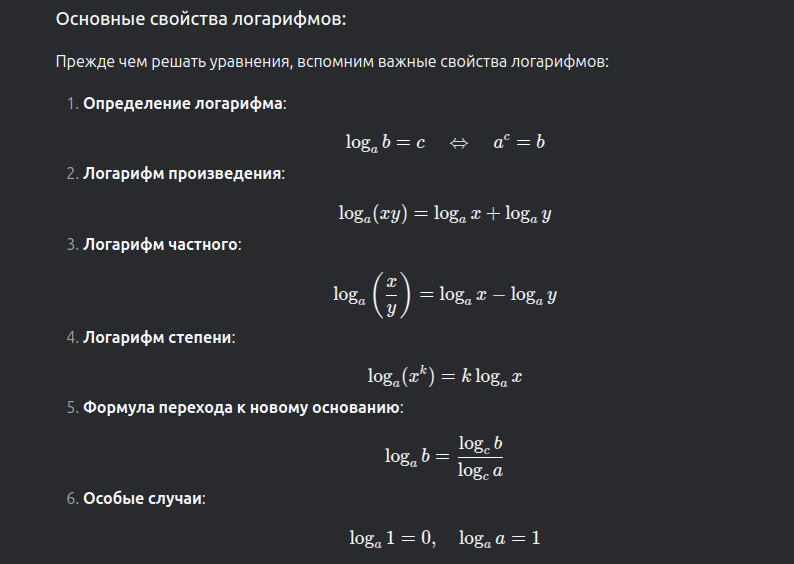

# Math & Alg
Сложность алгоритма - это мера того, сколько ресурсов (времени или памяти) требуется для выполнения алгоритма в зависимости от размера входных данных. Обычно сложность выражается с помощью "O-большого" нотация.

O-большое (Big O) - это нотация, которая описывает асимптотическое поведение функции, то есть ее поведение при стремлении аргумента к бесконечности.

Примеры O-большого:

#### O(1) - константная сложность. Время выполнения алгоритма не зависит от размера входных данных.
#### O(log n) - логарифмическая сложность. Время выполнения алгоритма растет пропорционально логарифму размера входных данных. Пример: поиск в сбалансированном бинарном дереве.
#### O(n) - линейная сложность. Время выполнения алгоритма растет пропорционально размеру входных данных. Пример: поиск в несбалансированном бинарном дереве в худшем случае.
#### O(n log n) - линейно-логарифмическая сложность. Пример: сортировка слиянием.
#### O(n^2) - квадратичная сложность. Время выполнения алгоритма растет пропорционально квадрату размера входных данных. Пример: сортировка пузырьками.
#### #O(2^n) - экспоненциальная сложность. Время выполнения алгоритма растет экспоненциально с увеличением размера входных данных.

## что такое log ?
****
